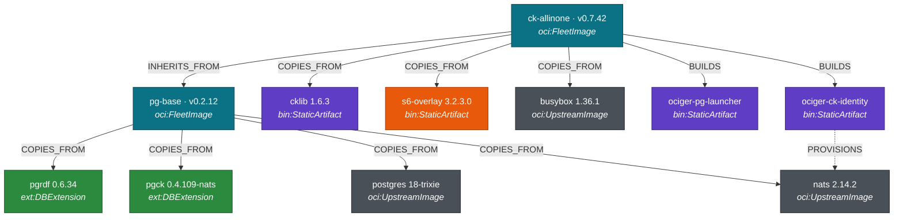

# oci-germination — Sporaxis-Com's Concept Kernel v3.12 container distribution


This repo ships the OCI container artifacts that make a **CKP v3.12 ([pgCK](https://github.com/styk-tv/pgCK)) runtime** trivial to stand up: PostgreSQL 18 (trixie) with `pgRDF` (the parallel-ingest RDF graph engine) and `pgCK` (governed-write + concept-kernel runtime) preloaded, NATS for the WebSocket transport browsers talk to, and CK.Lib.Js mounted at `/cklib/` so a page can become a concept-kernel client in one line.

> **Wave.** The image ships **both** the v3.11 and v3.12 FINAL ontology trees; `ckp.boot()` grounds on the **v3.12 root** (pgCK 0.4.82+). `init.sql` still seals its two module Adoptions against the **v3.11** `wave`/`lexicon` modules — v3.12 ships no `lexicon` module, and re-grounding a live kernel is a governed act, never a boot side effect.

The repo is a **layer-addition shop, not a compile shop**: pg base + extensions come pre-composed from upstream, this side just stacks `s6-overlay`, `busybox httpd`, and CK.Lib.Js on top to produce a marketplace-shaped image.

> **New here?** → **[GETTING-STARTED.md](./GETTING-STARTED.md)** is the adopter on-ramp: one `docker run`, the hello-kernel journey, and how a game / experiment / software project maps onto the substrate. The journey is runnable — [`examples/hello-kernel/`](./examples/hello-kernel/).

> **Auditing the supply chain?** → jump to [**The fleet as a typed composition**](#the-fleet-as-a-typed-composition) and [**Attestation — what is proven, and how**](#attestation--what-is-proven-and-how). Every artifact in every image is classified, versioned, sourced, and its attestation method is named — including the one component we *cannot* attest yet, declared plainly.

---

## Why concept kernels (light read)

A **Concept Kernel** is a small self-describing, self-governing being that owns a slice of meaning. It carries its own ontology (what types can exist here), its own affordances (what verbs can be invoked), its own instances (the data that lives under it), and — when it climbs the capability tiers — its own sealing and proof. In [BFO](https://basic-formal-ontology.org/) terms a kernel sits as a `BFO:0000040`-class material entity for the purposes of stable identity and part-of relations: it endures, it has parts (ontology / tool / data), and it can be addressed independently. In [PROV-O](https://www.w3.org/TR/prov-o/) terms a kernel is a `prov:Agent` whose affordances generate `prov:Activity` invocations that mutate `prov:Entity` instances under it, each activity producing a sealed, auditable record. The CKP v3.12 line makes this concrete: kernels live in the pgRDF graph, declare their shape in SHACL, expose verbs over NATS-WSS, and carry an append-only proof chain. This repo ships the runtime container that hosts it.

### A gaming example (one sentence)

The design target: a `Space.Ship` is a kernel that declares the `Ship` class, the SHACL shape that says a ship has a `name` and a `hull_integrity`, and an affordance `Space.Ship.dock`; players invoke `ckp://Action#Space.Ship.dock` over WSS, the runtime resolves the URN, validates the input against the shape, mutates the addressed instance, and broadcasts the event — no REST endpoint, no per-type table, no bespoke server code. A sibling `Match` kernel composes several `Space.Ship` instances + a `Session` kernel into a live multiplayer round, governed end-to-end.

What the **published image does today** is the same machinery one capability short of that target: governed, sealed, proof-chained kernels with tasks + goals, and consensus-gated type evolution — first-class custom classes like `Ship` are the next pgCK milestone.

---

## The fleet as a typed composition

We don't describe these images as "a Dockerfile that COPYs some stuff." Every artifact in every bundle is one of **five ontology entity types** (the same closed set the [`sporaxis`](https://github.com/sporaxis-com/sporaxis) composer validates). Organising the fleet by *what kind of thing each artifact is* — and naming its source and attestation next to it — is the whole transparency posture. The classes:

| Ontology class | What it is | In this fleet |
|---|---|---|
| `oci:FleetImage` | an image **we** publish (owns a version + GHCR tag + its own attestation) | 12 published · **2 on the active wave** |
| `oci:UpstreamImage` | an image we **consume**, never publish | 3 |
| `ext:DBExtension` | a Postgres extension (`.so` + `.control` + `.sql`) | 3 |
| `bin:StaticArtifact` | a binary / library / static asset, built in-tree or copied from upstream | 4 |
| `svc:Process` | a supervised runtime process | 4 |

Everything below is the **currently-shipping wave** (`ck-allinone v0.7.42` on `pg-base v0.2.12`). `LATEST.md` is the auto-rendered, attestation-verified authority for exact live tags; this table is the human-readable map.

### `ext:DBExtension` — the graph + governance surface (3)

| Extension | Version | Source | Attestation |
|---|---|---|---|
| `pgrdf` | `0.6.34` — the vacuity-refusal release: validating against an empty/unseeded graph now REFUSES instead of returning `conforms:true` | [`styk-tv/pgRDF`](https://github.com/styk-tv/pgRDF) → `ghcr.io/styk-tv/pgrdf-bundle` | **gh-SLSA ✓** verified both arches |
| `pgck` | `0.4.109` — CKP v3.12; the wave that closed pgCK's obligation ledger (C-1…C-17, D-1, E-1…E-5): a stored digest must carry its method, the engine builds on pgRDF's surface, and every refusal site is typed | [`styk-tv/pgCK`](https://github.com/styk-tv/pgCK) → `ghcr.io/styk-tv/pgck` | **gh-SLSA ✓** verified both arches |
| `pgcrypto` | builtin (pg18) | PostgreSQL `contrib` | inherited from the postgres image |

### `bin:StaticArtifact` — libraries + in-tree tooling (4)

| Artifact | Version | Source | Attestation |
|---|---|---|---|
| `cklib` (→ `/app/cklib/`) | `1.6.3` — the determinism line: refusals throw verbatim, `kernel` required at construction, id-form the only publish (no anonymous tier) | [`ConceptKernel/CK.Lib.Js`](https://github.com/ConceptKernel/CK.Lib.Js) → `ghcr.io/conceptkernel/ck-lib-js` | **gh-SLSA ✓** |
| `s6-overlay` (PID 1) | `3.2.3.0` | [`just-containers/s6-overlay`](https://github.com/just-containers/s6-overlay) release tarball, `curl`'d in the build | **⚠ NONE** — no upstream attestation, no checksum pin (see below) |
| `ociger-pg-launcher` | rolls with bundle | this repo → `cmd/ociger-pg-launcher` (Go) | fleet-CI, transitive via the FleetImage attestation |
| `ociger-ck-identity` | rolls with bundle | this repo → `cmd/ociger-ck-identity` (Go); boot-time auth-callout provisioner — mints/derives the callout account, writes `nats-server.conf` + `pgck.conf`. The account seed is **never baked into the image** | fleet-CI, transitive |

> **Retired:** `ociger-pgck-relay` (the Go bus bridge) was **deleted in v0.7.30** — pgCK's `-nats` build owns in-extension inbound dispatch, the `$SYS.REQ.USER.AUTH` auth-callout responder, and the `ckp.outbox` drain in-process. There is no host relay.

### `oci:UpstreamImage` — consumed bases (3)

| Image | Version | Attestation |
|---|---|---|
| `postgres` | `18-trixie` (glibc 2.41) | docker-official (registry provenance; not gh-attestable) |
| `busybox` | `1.36.1-musl` (httpd applet on `:8000`) | docker-official |
| `nats` | `2.14.2` (core `:4222` + WSS `:9222`) | docker-official |

### `svc:Process` — the supervised runtime (4)

`ck-identity` (**oneshot**) · `postgres` · `nats` · `httpd` (busybox applet). PID 1 is `s6-svscan`; s6-rc orders them by declared `dependencies.d/`, not filename ordinals — `postgres` and `nats` both depend on `ck-identity`, which must finish writing their config before either starts. `httpd` has no dependency. Each carries a `SMOKES_BY` assertion the CI gate runs against a fresh volume (see [Attestation](#attestation--what-is-proven-and-how)).

Since v0.7.31 the two exposed longruns drop privileges: `nats-server` and `busybox httpd` run as non-root (`nats:998` / `httpd:997`), and the account seed is `0640` owned by postgres.

### `oci:FleetImage` — what we publish (12)

All multi-arch (`linux/amd64`, `linux/arm64`), all SLSA Build Provenance v1 attested by GitHub Actions, all on GHCR. `LATEST.md` carries the live tags.

**Only two are on the active wave.** The pg17 matrix was frozen at the pg18 move — pgRDF and pgCK are pg18-only from pgRDF v0.6.20, so no pg17 artifact exists to pin (tracked in og#9). Frozen images stay published on GHCR but no longer advance.

| Image | Head | Role |
|---|---|---|
| **`ociger-ck-allinone`** | `v0.7.42` | Marketplace-minimal CKP v3.12 runtime — the full stack. **Default for prod.** |
| `ociger-pg18-pgrdf-pgck-nats-micro` | `v0.2.12` | The **`pg-base`** `ck-allinone` inherits — pg18/trixie + pgRDF + pgCK + NATS, scratch. |
| `ociger-pg17-*` (5 images) | — | **RETIRED** at the pg18 move (og#9). |
| `ociger-core-pg17-{nats,nats-micro,micro,min}` | — | pg17 cores, no extensions. Not on the wave. |
| `ociger-pg17-pgrdf-pgck-static-cklib` | `v0.6.7` | as `ck-allinone` but in-tree static server. **Frozen** — needs a coordinated re-cut, not a pin bump. |
| `ociger-pgck-bench` | `v0.1.1` | **devel/benchmark sibling** (Python/FastAPI). `never-prod=true`; runs *beside* prod, never inside. **Frozen.** |

All non-frozen bundles share **one** set of component pins via [`versions.yaml`](./versions.yaml) (the single source of truth — pgRDF 0.6.34 · pgCK 0.4.109 · cklib 1.6.3); `scripts/check-versions.sh` fails CI if any Dockerfile or `bundle.yaml` disagrees. It also carries the **ontology module digests** the init Adoptions seal — a pin that is compared, not merely carried.

---

## How the classes compose — `ck-allinone`

`ck-allinone` is **not** a re-pull of pg18/pgRDF/pgCK — those enter **once**, inside `pg-base`, which `ck-allinone` inherits. The Delta on top is s6 + busybox + cklib + the two Go tools:



There is **no `SHIMS_FOR` edge any more** — the Go relay that used to bridge the bus was deleted in v0.7.30 when pgCK's `-nats` build took inbound dispatch in-process.

The six edge types (`INHERITS_FROM`, `COPIES_FROM`, `BUILDS`, `SUPERVISES`, `SHIMS_FOR`, `SMOKES_BY`) are the closed predicate set; `SUPERVISES`/`SMOKES_BY` are elided above for legibility.

---

## Attestation — what is proven, and how

**110% transparency means stating the ceiling as plainly as the floor.** Here is exactly what is and isn't proven today.

**What ships and verifies now:**
- Every `oci:FleetImage` carries a **SLSA Build Provenance v1** attestation. `gh attestation verify oci://<image>:<tag> --repo sporaxis-com/oci-germination` returns exit 0. This proves *the image digest was built by this repo's GitHub Actions from a specific commit* — a **build** attestation.
- The three externally-attested components (`pgRDF`, `pgCK`, `cklib`) each carry their **own** gh-SLSA attestation in their source repos, verifiable by digest (see the tables above).
- Attestation is **smoke-gated**: an image cannot advance to attestation unless its `SMOKES_BY` gate passes on a fresh volume (`build-bundles.yml`, per-bundle release workflows).

**What is NOT yet proven — named, not hidden:**

| Component | Attestation method | gh-verifiable? |
|---|---|---|
| pgRDF · pgCK · cklib · our FleetImages | gh-SLSA Build Provenance v1 | ✅ yes |
| postgres · busybox · nats | docker-official (registry provenance) | ⚠️ not via `gh attestation` |
| **s6-overlay** | **none** — `curl`'d tarball, no attestation, no checksum pin | ❌ **no — declared gap** |
| pgcrypto · in-tree Go tools | inherited / transitive via the image build | ➖ n/a |

- The **build** attestation on `ck-allinone` does **not yet link** the upstream component attestations into one supply-chain chain. A verifier learns "built by us," not "and layer *N* is pgRDF 0.6.19, itself attested by styk-tv." Closing that — a per-component provenance manifest, mapped to layers, linked into the image attestation — is active work in [`sporaxis`](https://github.com/sporaxis-com/sporaxis) (the `composition.ttl` already emits per-component `digest + origin + attestation-method`, with the **s6-overlay gap forced to be a declared exemption**, not silence).
- `s6-overlay` is the honest hole: pinned by release tag only. It is called out here, in the graph (orange), and in the composition — never quietly.

See [`PROVENANCE.md`](./PROVENANCE.md) for the publishing rules and the attestation chain.

---

## Inside the image — bytes (the additive layers)

The ontology view above is *what* is composed. This is *how many bytes*, and it also shows **why per-component provenance needs the referenced manifest** (in progress): additive Docker layers **squash** distinct sources together, so you cannot attest at layer granularity — e.g. layer 1 mixes fleet-authored `.so`s with the upstream pg18 binary and ICU data.

<details>
<summary><b>Layer composition</b> (compressed, amd64 — measured against <code>v0.7.41</code>, digest <code>sha256:33467542…</code>)</summary>

| # | MB (gz) | Class-mix / role |
|---|---:|---|
| 1 | 43.90 | `pg-base` — pg18 binary + `pgrdf`/`pgck` `.so` + ICU/glibc/TLS/Kerberos (**mixed: DBExtension + UpstreamImage**) |
| 2–3 | 3.20 | `pg-base` — `ociger-pg-launcher` + `ociger-supervisor` (StaticArtifact) |
| 4 | 6.52 | `pg-base` — `nats-server` (UpstreamImage) |
| 5 | 0.00 | `pg-base` — `nats-server.conf` |
| 6 | 2.68 | Delta — `s6-overlay` (StaticArtifact ⚠ unattested) |
| 7 | 0.73 | Delta — `/bin/busybox` (UpstreamImage) |
| 8 | 0.09 | Delta — `cklib` → `/app/cklib/` (StaticArtifact) |
| 9–12 | 0.01 | Delta — `/app/{index,web,web2,wss}` static pages |
| 13 | 1.60 | Delta — `ociger-pg-launcher` (StaticArtifact) |
| 14 | 0.01 | Delta — `init.sql` |
| 15 | 1.20 | Delta — `ociger-ck-identity` (StaticArtifact) |
| 16–17 | 0.00 | Delta — `nats-server.conf` + s6 service definitions |
| **Σ** | **59.93** | ~155.8 MB uncompressed |

`pg-base` alone is ~142.7 MB uncompressed, so the **Delta this repo adds is ~13 MB uncompressed / ~6.3 MB compressed** — s6-overlay and busybox account for most of it, the two in-tree Go binaries for the rest. The bulk of layer 1 is upstream pg18 + ICU, not fleet code.

</details>

---

## Run

```bash
docker run --rm -d --name ck-allinone \
  -v "$PWD/ck-allinone-data:/var/lib/postgresql/data" \
  -p 15432:5432 -p 18000:8000 -p 14222:4222 -p 19222:9222 \
  ghcr.io/sporaxis-com/ociger-ck-allinone:v0.7.42
```

The image is **ready-to-use** on a fresh volume: extensions are auto-created, the kernel's module Adoptions are sealed, and `pgck.nats_url` is set on first boot — no consumer SQL. Verify:

```bash
# extensions already present (NOT created by you) at the expected versions
docker run --rm --network host postgres:18-trixie psql -h 127.0.0.1 -p 15432 -U postgres -d postgres \
  -c "SELECT extname, extversion FROM pg_extension WHERE extname IN ('pgrdf','pgck','pgcrypto');"

curl -I http://127.0.0.1:18000/cklib/ck-client.js        # busybox httpd serving cklib → 200
nc -zv 127.0.0.1 19222                                    # NATS WSS listening

# supply-chain: verify the build attestation
gh attestation verify oci://ghcr.io/sporaxis-com/ociger-ck-allinone:v0.7.42 \
  --repo sporaxis-com/oci-germination
```

> `busybox httpd` serves **static files only** — GET/HEAD. It is started with no CGI config, so POST/PUT/DELETE return `501 Not Implemented` by design. All kernel data flows over `/wss`, never HTTP. There is no REST path and no `/ontology` HTTP mount (retracted in v0.7.41 — law confirmation is wire-native).

Browser smoke: open `http://127.0.0.1:18000/` — the landing page opens NATS over WSS and renders **✓ WSS round-trip OK**.

---

## Repository layout

```
bundles/                     OCI bundle Dockerfiles + bundle.yaml + s6 service trees
cmd/                         ociger-pg-launcher, ociger-ck-identity, ociger-gen (+ legacy tools)
scripts/                     build-* and smoke-* per bundle; check-versions.sh (drift gate); cut-plan.sh; preflight-local.sh (the full local gate)
tests/local-tdd/             three-state suite (0=GREEN, 44=RED-as-predicted, other=BROKEN)
versions.yaml                single source of truth for component pins (drift-gated)
.github/workflows/           release pipelines (one per bundle line; all attest via SLSA v1)
LATEST.md                    auto-rendered head per bundle (attestation-gated; no manual edits)
PROVENANCE.md                publishing rules + attestation chain
CONTRIBUTING.CI.md           tag/release flow
```

---

## Discipline

- **No manual GHCR pushes.** Every published image carries a verifiable SLSA Build Provenance v1 attestation from the release workflows. See [`PROVENANCE.md`](./PROVENANCE.md).
- **`LATEST.md` is auto-rendered** — refreshes only after `gh attestation verify` accepts the digest; manual edits are reverted.
- **This repo never compiles upstream code.** pg18, pgRDF, pgCK, NATS, CK.Lib.Js, s6-overlay, busybox all arrive pre-built; the only binaries built here are the tiny in-tree Go tools.
- **Prod images are Python-free**, scratch-final, s6-supervised, busybox-served. `ociger-pgck-bench` is the sole sanctioned Python home and runs as a sibling, never embedded.
- **Every image carries `ck.bundle.role` + `ck.bundle.never-prod` labels** so tooling can refuse a `never-prod=true` image into prod.
- **Component versions are monotonic and never reused**; every release attempt (shipped or dropped) is recorded in [`CHANGELOG.md`](./CHANGELOG.md), so version gaps are always explained.
- **Every release runs the local gate first** — `scripts/preflight-local.sh` (drift gate → go tests → base build+smoke → bundle build+smoke → verify-callout → three-state suite) must be green before any tag is pushed, base-first per `scripts/cut-plan.sh`.

---

## References

- BFO: <https://basic-formal-ontology.org/> · PROV-O: <https://www.w3.org/TR/prov-o/>
- pgRDF: <https://github.com/styk-tv/pgRDF> · pgCK: <https://github.com/styk-tv/pgCK> · CK.Lib.Js: <https://github.com/ConceptKernel/CK.Lib.Js>
- Composition ontology + composer: <https://github.com/sporaxis-com/sporaxis>
- Attestation policy: [`PROVENANCE.md`](./PROVENANCE.md) · Tag/release flow: [`CONTRIBUTING.CI.md`](./CONTRIBUTING.CI.md)
